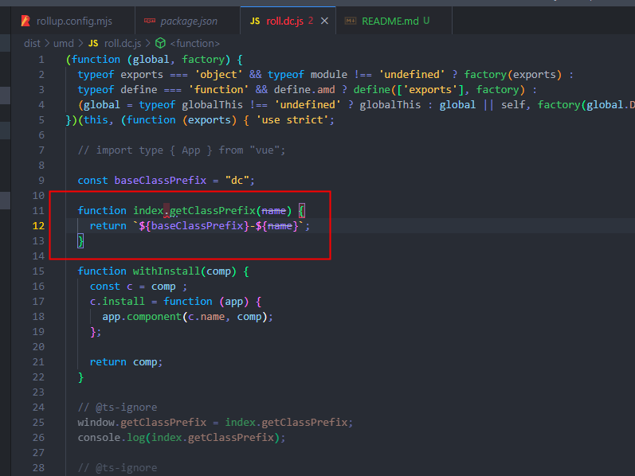

# rollup build issue

## how to reproduction

```shell
npm i
node rollup.config.mjs
cat ./dist/umd/roll.dc.js
```

## what's wrong

This is an occasional phenomenon, but in most cases, an `index.` prefix was added before `getClassPrefix` function name.

You can try a few more times, and it will reappear within about ten times


